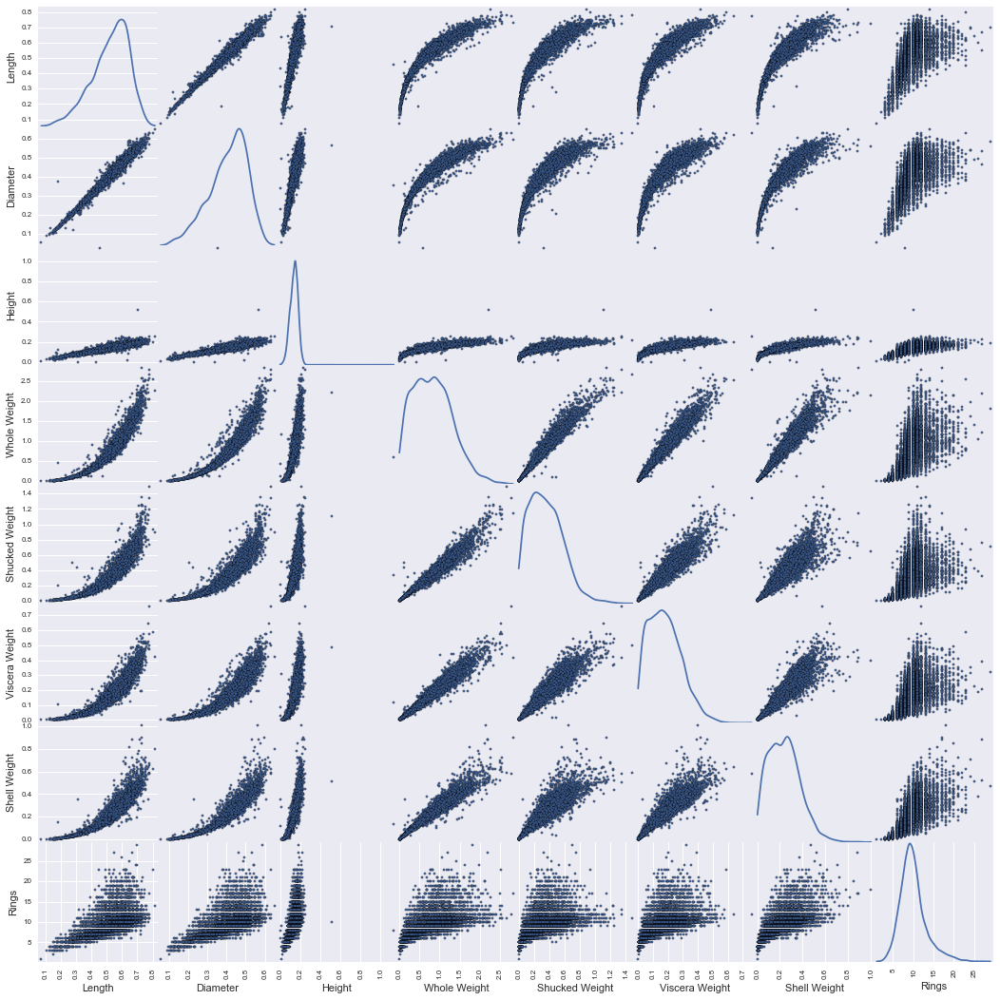
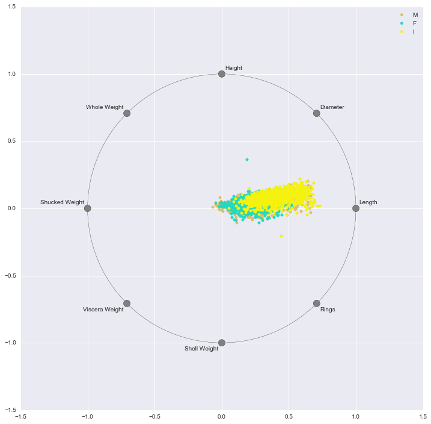

# Abalone Data Set

Data Set Characteristics: Multivariate

Attribute Characteristics: Categorical, Integer, Real

Number of Instances: 4177

Number of Attributes: 8

# Data Set Information
Predicting the age of abalone from physical measurements. The age of abalone is determined by cutting the shell through the cone, staining it, and counting the number of rings through a microscope. Other measurements, which are easier to obtain, are used to predict the age. Further information, such as weather patterns and location (hence food availability) may be required to solve the problem. 

From the original data examples with missing values were removed (the majority having the predicted value missing), and the ranges of the continuous values have been scaled for use with an ANN (by dividing by 200).


# Attribute Information
Given is the attribute name, attribute type, the measurement unit and a brief description. The number of rings is the value to predict: either as a continuous value or as a classification problem. 

Name / Data Type / Measurement Unit / Description 

Sex / nominal / -- / M, F, and I (infant) 

Length / continuous / mm / Longest shell measurement 

Diameter	/ continuous / mm / perpendicular to length 

Height / continuous / mm / with meat in shell 

Whole weight / continuous / grams / whole abalone 

Shucked weight / continuous	/ grams / weight of meat 

Viscera weight / continuous / grams / gut weight (after bleeding)

Shell weight / continuous / grams / after being dried 

Rings / integer / -- / +1.5 gives the age in years 


# Data Exploration
Let's explore the date to determine the relevant information. First we import the Python packages.


```python
%matplotlib inline

import os
import json
import time
import pickle
import requests

import numpy as np
import pandas as pd
import matplotlib.pyplot as plt

```

# Ingest Data from the UCI Machine Learning Repository


```python
URL = "https://archive.ics.uci.edu/ml/machine-learning-databases/abalone/abalone.data"

def fetch_data(fname='abalone.data'):
    """
    Helper method to retreive the ML Repository dataset.
    """
    response = requests.get(URL)
    outpath  = os.path.abspath(fname)
    with open(outpath, 'w') as f:
        f.write(response.content)
    
    return outpath

# Fetch the data if required
DATA = fetch_data()
```

How do I know for certain if the fetch_data works here?


```python
FEATURES  = [
    "Sex", 
    "Length", 
    "Diameter", 
    "Height", 
    "Whole Weight", 
    "Shucked Weight", 
    "Viscera Weight",
    "Shell Weight", 
    "Rings",
    ]

LABEL_MAP = {
    1: "1", 
    2: "2",
    3: "3",
    4: "4",
    5: "5",
    6: "6",
    7: "7",
    8: "8",
    9: "9",
    10: "10",
    11: "11",
    12: "12",
    13: "13",
    14: "14",
    15: "15",
    16: "16",
    17: "17",
    18: "18",
    19: "19",
    20: "20",
    21: "21",
    22: "22",
    23: "23",
    24: "24",
    25: "25",
    26: "26",
    27: "27",
    28: "28",
    29: "29"
}

#  Read the data into a DataFrame
df = pd.read_csv(DATA, sep=',', header=None, names=FEATURES)
print(df.head())
# Convert class labels into text
for k,v in LABEL_MAP.items():
    df.ix[df.Count == k, 'label'] = v

#check label values
print df.head()
```

      Sex  Length  Diameter  Height  Whole Weight  Shucked Weight  Viscera Weight  \
    0   M   0.455     0.365   0.095        0.5140          0.2245          0.1010   
    1   M   0.350     0.265   0.090        0.2255          0.0995          0.0485   
    2   F   0.530     0.420   0.135        0.6770          0.2565          0.1415   
    3   M   0.440     0.365   0.125        0.5160          0.2155          0.1140   
    4   I   0.330     0.255   0.080        0.2050          0.0895          0.0395   
    
       Shell Weight  Rings  
    0         0.150     15  
    1         0.070      7  
    2         0.210      9  
    3         0.155     10  
    4         0.055      7  
    


    ---------------------------------------------------------------------------

    AttributeError                            Traceback (most recent call last)

    <ipython-input-10-b7a33378f4b6> in <module>()
         48 # Convert class labels into text
         49 for k,v in LABEL_MAP.items():
    ---> 50     df.ix[df.Count == k, 'label'] = v
         51 
         52 #check label values
    

    C:\Users\drewkwheatley\Anaconda2\lib\site-packages\pandas\core\generic.pyc in __getattr__(self, name)
       2358                 return self[name]
       2359             raise AttributeError("'%s' object has no attribute '%s'" %
    -> 2360                                  (type(self).__name__, name))
       2361 
       2362     def __setattr__(self, name, value):
    

    AttributeError: 'DataFrame' object has no attribute 'Count'


I'm not sure what the AttributeError is trying to tell me here.


```python
print df.describe()
```

                Length     Diameter       Height  Whole Weight  Shucked Weight  \
    count  4177.000000  4177.000000  4177.000000   4177.000000     4177.000000   
    mean      0.523992     0.407881     0.139516      0.828742        0.359367   
    std       0.120093     0.099240     0.041827      0.490389        0.221963   
    min       0.075000     0.055000     0.000000      0.002000        0.001000   
    25%       0.450000     0.350000     0.115000      0.441500        0.186000   
    50%       0.545000     0.425000     0.140000      0.799500        0.336000   
    75%       0.615000     0.480000     0.165000      1.153000        0.502000   
    max       0.815000     0.650000     1.130000      2.825500        1.488000   
    
           Viscera Weight  Shell Weight        Rings  
    count     4177.000000   4177.000000  4177.000000  
    mean         0.180594      0.238831     9.933684  
    std          0.109614      0.139203     3.224169  
    min          0.000500      0.001500     1.000000  
    25%          0.093500      0.130000     8.000000  
    50%          0.171000      0.234000     9.000000  
    75%          0.253000      0.329000    11.000000  
    max          0.760000      1.005000    29.000000  
    


```python
# Determine shape of the data
print "{} instances with {} features\n".format(*df.shape)

# Determine frequency of each class
print df.groupby('Rings')['Rings'].count()
```

    4177 instances with 9 features
    
    Rings
    1       1
    2       1
    3      15
    4      57
    5     115
    6     259
    7     391
    8     568
    9     689
    10    634
    11    487
    12    267
    13    203
    14    126
    15    103
    16     67
    17     58
    18     42
    19     32
    20     26
    21     14
    22      6
    23      9
    24      2
    25      1
    26      1
    27      2
    29      1
    Name: Rings, dtype: int64
    

We can see ages of the Abalone fall on a bell curve, with the most frequent age being 8-10. 

# Data Visualization
Let's create some cool graphs.


```python
from pandas.tools.plotting import scatter_matrix
scatter_matrix(df, alpha=1, figsize=(18, 18), diagonal='kde')
plt.show()
```





```python
from pandas.tools.plotting import radviz
plt.figure(figsize=(12,12))
radviz(df, 'Sex')
plt.show()
```





# Data Extraction


```python
import os
from sklearn.datasets.base import Bunch

DATA_DIR = os.path.abspath(os.path.join(".", "..", "data",'abalone'))

# Show the contents of the data directory
for name in os.listdir(DATA_DIR):
    if name.startswith("."): continue
    print "- {}".format(name)
```

This is where I get lost. When looking at other examples, I notice that text should appear under this cell. But I can't get that text to appear here, and I think it's preventing me from taking the next step. For instance, in the Contraceptive notebook, I'm seeing

- cmc.txt
- dataset.csv
- meta.json
- README.MD
- wrangle.py


```python
import json 


meta = {
    'target_names': list(data.rings.unique()),
    'feature_names': list(data.columns),
    'categorical_features': {
        column: list(data[column].unique())
        for column in data.columns
        if data[column].dtype == 'object'
    },
}

with open('data/meta.json', 'w') as f:
    json.dump(meta, f, indent=2)
```


    ---------------------------------------------------------------------------

    NameError                                 Traceback (most recent call last)

    <ipython-input-7-e250a7ac3255> in <module>()
          3 
          4 meta = {
    ----> 5     'target_names': list(data.rings.unique()),
          6     'feature_names': list(data.columns),
          7     'categorical_features': {
    

    NameError: name 'data' is not defined


I am using the same code Ben had in his census notebook to create a meta.json file. I swapped out data.income.unique with data.rings.unique. I am getting a NameError telling me "name 'data' is not defined"


```python
def load_data(root=DATA_DIR):
    # Construct the `Bunch` for the dataset
    filenames     = {
        'meta': os.path.join(root, 'meta.json'),
        'rdme': os.path.join(root, 'README.md'),
        'data': os.path.join(root, 'abalone.data'),
    }

    # Load the meta data from the meta json
    with open(filenames['meta'], 'r') as f:
        meta = json.load(f)
        target_names  = meta['target_names']
        feature_names = meta['feature_names']

    # Load the description from the README. 
    with open(filenames['rdme'], 'r') as f:
        DESCR = f.read()

    # Load the dataset from the text file.
    dataset = np.loadtxt(filenames['data'], delimiter=',')

    # Extract the target from the data
    data   = dataset[:, 0:-1]
    target = dataset[:, -1]

    # Create the bunch object
    return Bunch(
        data=data,
        target=target,
        filenames=filenames,
        target_names=target_names,
        feature_names=feature_names,
        DESCR=DESCR
    )

# Save the dataset as a variable we can use.
dataset = load_data()

print dataset.data.shape
print dataset.target.shape
```


    ---------------------------------------------------------------------------

    IOError                                   Traceback (most recent call last)

    <ipython-input-6-f814d1f85ad1> in <module>()
         35 
         36 # Save the dataset as a variable we can use.
    ---> 37 dataset = load_data()
         38 
         39 print dataset.data.shape
    

    <ipython-input-6-f814d1f85ad1> in load_data(root)
          8 
          9     # Load the meta data from the meta json
    ---> 10     with open(filenames['meta'], 'r') as f:
         11         meta = json.load(f)
         12         target_names  = meta['target_names']
    

    IOError: [Errno 2] No such file or directory: 'C:\\Users\\drewkwheatley\\xbus\\machine-learning\\examples\\data\\abalone\\meta.json'


This time I used the code from the Contraceptive notebook. My efforts to create the meta.json file have failed. 

# Classification

Let's attempt to build a classifier with kNN, SVM, and Random Forest classifiers.


```python
from sklearn import metrics
from sklearn import cross_validation
from sklearn.cross_validation import KFold

from sklearn.svm import SVC
from sklearn.neighbors import KNeighborsClassifier
from sklearn.ensemble import RandomForestClassifier
```


```python
def fit_and_evaluate(dataset, model, label, **kwargs):
    """
    Because of the Scikit-Learn API, we can create a function to
    do all of the fit and evaluate work on our behalf!
    """
    start  = time.time() # Start the clock! 
    scores = {'precision':[], 'recall':[], 'accuracy':[], 'f1':[]}
    
    for train, test in KFold(dataset.data.shape[0], n_folds=12, shuffle=True):
        X_train, X_test = dataset.data[train], dataset.data[test]
        y_train, y_test = dataset.target[train], dataset.target[test]
        
        estimator = model(**kwargs)
        estimator.fit(X_train, y_train)
        
        expected  = y_test
        predicted = estimator.predict(X_test)
        
        # Append our scores to the tracker
        scores['precision'].append(metrics.precision_score(expected, predicted, average="weighted"))
        scores['recall'].append(metrics.recall_score(expected, predicted, average="weighted"))
        scores['accuracy'].append(metrics.accuracy_score(expected, predicted))
        scores['f1'].append(metrics.f1_score(expected, predicted, average="weighted"))

    # Report
    print "Build and Validation of {} took {:0.3f} seconds".format(label, time.time()-start)
    print "Validation scores are as follows:\n"
    print pd.DataFrame(scores).mean()
    
    # Write official estimator to disk
    estimator = model(**kwargs)
    estimator.fit(dataset.data, dataset.target)
    
    outpath = label.lower().replace(" ", "-") + ".pickle"
    with open(outpath, 'w') as f:
        pickle.dump(estimator, f)

    print "\nFitted model written to:\n{}".format(os.path.abspath(outpath))
```


```python
# Perform SVC Classification
fit_and_evaluate(dataset, SVC, "Abalone SVM Classifier", )
```


    ---------------------------------------------------------------------------

    NameError                                 Traceback (most recent call last)

    <ipython-input-14-300408cad2b5> in <module>()
          1 # Perform SVC Classification
    ----> 2 fit_and_evaluate(dataset, SVC, "Abalone SVM Classifier", )
    

    NameError: name 'dataset' is not defined


I am using the same code from the Contraceptive notebook. I'm not sure what I'm doing wrong here.
